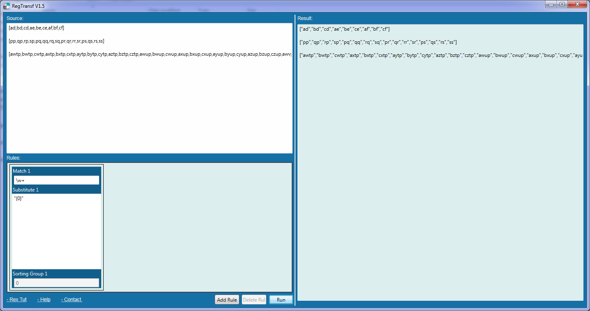

rexreplace
==========

A simple text transformation tool based on regular expression matching and text replacement with limited text transformation expression support.

see help.txt for more information.

Example usage - add double quotes around string values:

todo
==========
 -  Need function {case SRC_VALUE, DEST_VALUE1, RESULT1, DEST_VALUE2, RESULT2, ....}
 -  
